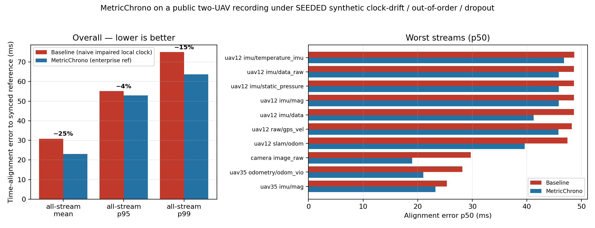

# MetricChrono on two real UAVs

*Take a public two-drone recording, disrupt its timing the way a real network would, and see how
much sensor-fusion alignment MetricChrono recovers — then reproduce the analysis bit-for-bit
yourself in about thirty seconds.*

When several robots share one picture of the world, the quiet failure mode is rarely the sensors.
It's *time*: whose measurement happened when. Let a clock drift, drop a handful of packets, deliver
frames out of order, and naive timestamp alignment falls apart — usually slowly enough that you
don't notice until fusion is already wrong.

This demo starts from a public recording of two cooperative UAVs — a LiDAR-equipped primary and a
camera/VIO secondary — that has been put through exactly that kind of damage under a fixed seed:
clock-drift, out-of-order delivery, and packet loss. It shows how much of the original alignment the
MetricChrono engine recovers, and ships that output alongside a pure-pandas analysis you can re-run
deterministically.

> **The recording** is the CTU-MRS *Heterogeneous UAV dataset for relative localization and
> cooperative flight* (Pritzl, Vrba, Štěpán & Saska — [arXiv:2306.17544](https://arxiv.org/abs/2306.17544)),
> a public, chrony-synchronized flight. The disruption layered on top is synthetic but fully
> seeded (`424242`): 5–200 ms of network delay, 15% of messages reordered, five burst-loss
> windows, and one 3-second partition. Same seed, same damage, every run.



## Try it

```bash
pip install -r requirements.txt
bash run_demo.sh
```

About thirty seconds, nothing exotic — just `numpy`, `pandas`, `pyarrow`, and `matplotlib`. You get
a short `RESULTS.md`, the figure above (`out/hero_alignment.png`), and a machine-checkable
`out/determinism.json`.

Under the hood, the run reads the bundled circle-flight data, re-derives the change-code analysis,
and checks three things you can see for yourself:

- **Deterministic** — two passes produce byte-for-byte identical output (a SHA-256 over all twelve
  result tables).
- **Order-sensitive** — shuffle the arrival order and the output changes, so it isn't just echoing a
  constant.
- **The shipped result** — the correction column is fingerprinted against what's committed.

What you're verifying on your own machine is the *analysis* — not a re-run of the proprietary
encoder, which isn't in this repo.

## What it recovers

Alignment error is the gap between each corrected timestamp and the synchronized reference timeline,
pooled across streams. The headline comes from the **full two-flight** run (circle + figure-eight),
recorded in `data/metrics_table.csv`:

|                              | naive impaired clock (`t_obs`) | MetricChrono |
|------------------------------|--:|--:|
| all streams, mean            | 30.9 ms                        | 23.0 ms **−25%** |
| all streams, p99             | 75.0 ms                        | 63.7 ms −15% |
| camera stream, p50           | 29.7 ms                        | 19.0 ms **−36%** |
| uav12 SLAM-odom, p50         | 47.4 ms                        | 39.6 ms −17% |

The relayed camera stream — the one that suffers most under reordering — is where the gap is widest.
The reconciliation behind it costs about **0.47%** in bandwidth.

## What's real here, and what isn't

A few limits worth being upfront about:

- The bundled data is the **circle subset**; the headline is the **full run**. The committed parquet
  (`data/events_impaired_circle.parquet`) is the circle flight only — it carries the engine's output
  (corrected timestamps and alignment errors, with the internal decision signals stripped out) and
  drives the live reproducibility check and the figure. The −25% / −36% numbers are the full
  two-flight result, read from the committed table.
- "Reproducible" here means the **analysis, not the encoder**. Running the demo proves the change-code
  analysis is identical run to run; it does not re-execute the engine that produced the corrections.
- The comparison is **in-sample**: calibration is fit on the reference timeline (holdout off), and the
  baseline is a naive impaired clock rather than a tuned aligner. Out-of-sample numbers and a
  header-stamp baseline need the full engine.

## Open core vs. the engine

The corrections here were produced by the MetricChrono **enterprise engine** — the stateful part
that handles fleet timing, gap routing, out-of-distribution and robustness checks, and reordering.
That engine is proprietary and deliberately not in this repo.

What *is* open is the primitive underneath it: the Apache-2.0
**[MetricChrono core](https://github.com/chrono-metrics/metricchrono)**, which turns distances
between states into a deterministic, multiscale change-code (the epsilon-delta-p comparator, the
ladder, and the base metrics). This repo ships the engine's output plus a pure-pandas analysis,
which is exactly why the reproducibility claim holds without anyone needing the engine itself.

## Scope, provenance, and license

MetricChrono is a measurement and evidence layer — deterministic time-alignment and change-coding —
not an autonomy, targeting, navigation, or weapons system, and it doesn't certify safety or mission
assurance.

- **Code** (`*.py`, `*.sh`) is **Apache-2.0** — see [`LICENSE`](LICENSE).
- **Data** (`data/`) is derived timing metadata computed from the public CTU-MRS recording, with no
  raw sensor payloads. We claim no rights over the source recording; if you build on it, honor
  CTU-MRS's terms and cite [arXiv:2306.17544](https://arxiv.org/abs/2306.17544). Details in
  [`NOTICE`](NOTICE) and [`DATA-LICENSE.md`](DATA-LICENSE.md).
